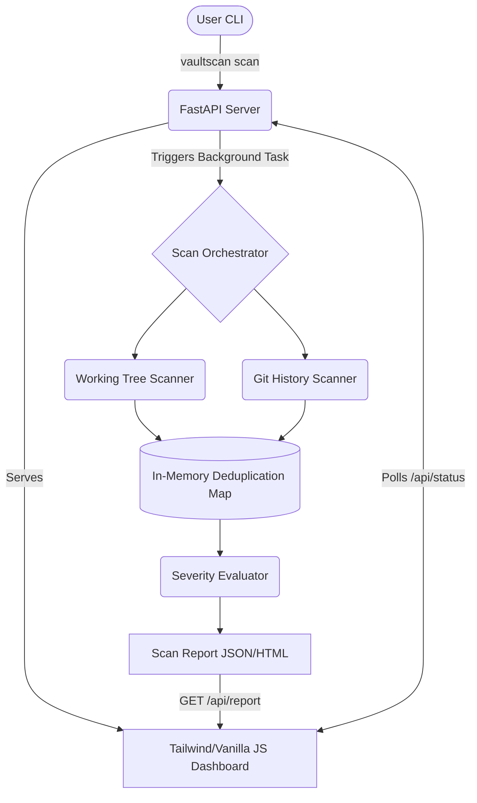
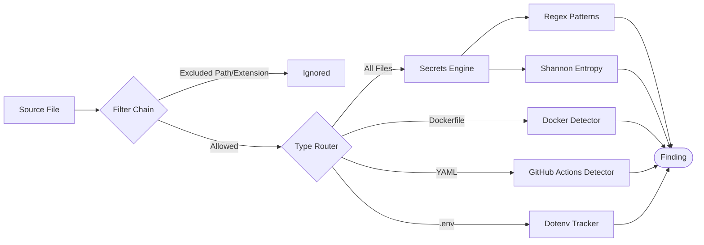

# VaultScan

VaultScan is a robust, 100% local scanner designed to detect exposed secrets and Infrastructure as Code (IaC) misconfigurations within Git repositories. It analyzes both the current working tree and the entire Git history using a 3-layer detection pipeline, presenting results in a sleek, real-time web dashboard.

**Zero Data Exfiltration:** VaultScan is built for absolute privacy. Your code and secrets never leave your machine. No cloud sync, no telemetrics.

---

## Architecture Overview

VaultScan operates as a standalone CLI tool that spins up an asynchronous local FastAPI backend and serves a dynamically polling web dashboard.



## Detection Pipeline

VaultScan uses a multi-layered approach to evaluate files. Every file passes through a strict filter chain before being routed to specific detector engines.



## Features

- **Secrets Detection:** Identifies exposed AWS, GitHub, OpenAI, and Stripe keys using precise regex patterns.
- **High Entropy Detection:** Calculates Shannon entropy as a secondary signal to elevate findings that regex might miss.
- **IaC Misconfiguration Scanner:** Detects dangerous patterns in Dockerfiles (`latest` tags, hardcoded `ENV` secrets, `curl | sh`), GitHub Actions (mutable branch references), and tracked `.env` files.
- **Deep Git History Scan:** Efficiently traverses the git commit tree to find credentials injected and deleted in the past.
- **Smart Deduplication:** Groups identical secrets found across multiple files or commits into a single actionable finding.
- **Real-Time Web Dashboard:** A premium, dark-mode, glassmorphism UI built with Tailwind CSS v4 to triage and filter findings.
- **Exportable Evidence:** Export findings as masked, secure JSON or standalone HTML reports.
- **Dual CLI Modes:** Launch the interactive dashboard, or run headlessly for integration into CI/CD pipelines.

## Installation

Ensure you have Python 3.11+ installed.

1. Clone the repository:
   ```bash
   git clone <your-repo-url>
   cd VaultScan
   ```
2. Install the tool locally:
   ```bash
   pip install -e .
   ```

*(Note: If you plan to modify the UI, you will also need Node.js to run `npm run build:css` to recompile the Tailwind v4 styles).*

## Usage

VaultScan provides a simple Command Line Interface.

### Interactive Mode (Web Dashboard)

To scan a repository and open the interactive Web Dashboard:
```bash
vaultscan scan /absolute/path/to/target/repository
```
This command starts the local FastAPI server, automatically triggers the scan, and opens the dashboard in your default browser. The server remains active until you press `Ctrl+C`.

### Headless Mode (CI / Automation)

To scan a repository without the web UI and exit immediately:
```bash
vaultscan scan /absolute/path/to/target/repository --headless
```
This will print the results directly to your terminal. It returns `exit code 1` if any secrets or misconfigurations are found, and `exit code 0` if the repository is clean.

## Tech Stack

- **Backend:** Python 3.11, FastAPI, Uvicorn, Pydantic, GitPython
- **Frontend:** Vanilla JS, HTML5, Tailwind CSS v4
